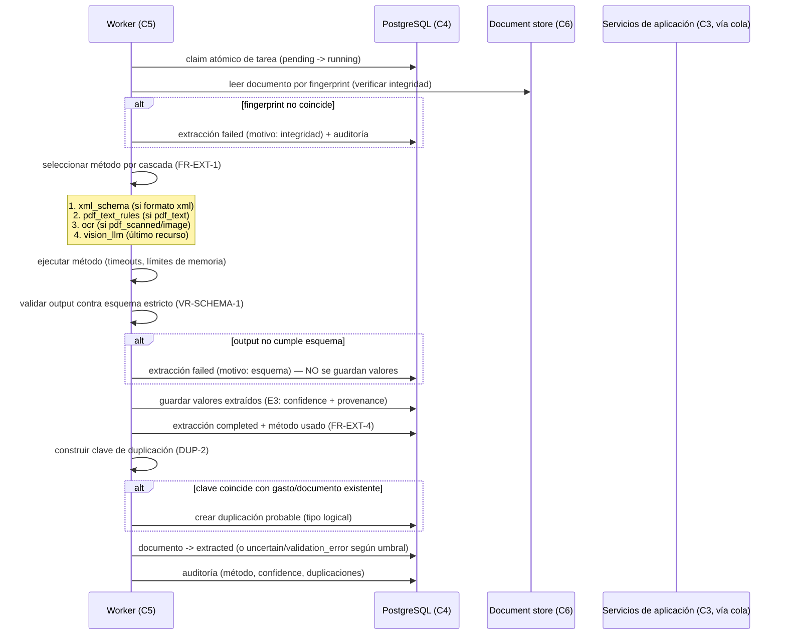
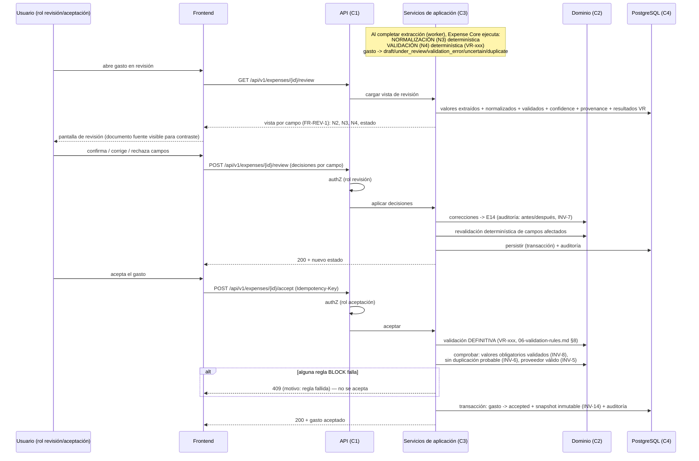

# 03 — Flujos principales (GastosE)

Tres flujos end-to-end: ingesta de documentos, extracción, y
revisión/aceptación. Se indica explícitamente dónde ocurre la normalización
(N3) y la validación determinística (N4), y cómo se preservan los cinco
niveles de valor (08-value-semantics.md).

## 1. Flujo de ingesta de documentos

```mermaid
sequenceDiagram
    participant U as Usuario
    participant FE as Frontend
    participant API as API (C1)
    participant APP as Servicios de aplicación (C3)
    participant DB as PostgreSQL (C4)
    participant DS as Document store (C6)

    U->>FE: selecciona archivo
    FE->>API: POST /api/v1/documents (multipart, Idempotency-Key)
    API->>API: authN + authZ (rol: lectura mínimo)
    API->>APP: subir documento
    APP->>APP: validar tamaño/páginas (límites C8) ANTES de procesar
    alt tamaño/páginas fuera de límites
        APP-->>FE: 422 (motivo) — no se crea documento fuente
    end
    APP->>APP: sniffing de magic bytes (formato real, FR-DOC-5)
    APP->>APP: calcular fingerprint SHA-256 (FR-DOC-2)
    APP->>DB: buscar documento con mismo fingerprint (DUP-1)
    alt fingerprint ya existe
        APP->>DB: crear duplicación probable (tipo fingerprint)
        APP-->>FE: 201 + advertencia de duplicado probable
    end
    APP->>APP: generar nombre seguro (UUID; FR-DOC-4)
    APP->>DS: escribir archivo (una única vez, inmutable)
    APP->>DB: registrar documento fuente (estado uploaded) + auditoría
    APP->>DB: crear tarea de extracción en cola (estado pending)
    APP-->>FE: 202 Accepted + Location: /api/v1/documents/{id}
    FE-->>U: "documento recibido, procesando"
```

**Puntos clave**:

- La subida responde rápido (NFR-6: < 5 s para 20 MB): la extracción NO se
  hace en la petición; se encola (ADR-0005).
- El nombre original nunca se usa en rutas (FR-DOC-4); solo se conserva como
  dato descriptivo.
- El documento se escribe una única vez; después es inmutable (INV-9). No
  existe operación de "reemplazar contenido": la única vía es subir un
  documento nuevo (FR-DOC-3).
- La detección por fingerprint (DUP-1) ocurre en la subida, antes de la
  extracción (DUP-3). No bloquea la ingesta: el documento se procesa igual,
  pero queda con duplicación `probable` (INV-6 bloquea la aceptación).
- Si el worker falla más adelante, el documento pasa a `failed` con motivo
  (FR-FST-1); ver [05-failure-semantics.md](05-failure-semantics.md).

## 2. Flujo de extracción (cascada determinística)



**Puntos clave**:

- **Cascada determinística** (FR-EXT-1): el método se elige por el formato
  detectado (magic bytes, no extensión). XML estructurado → `xml_schema` y
  NO se recurre a OCR/LLM. El nivel alcanzado se registra (E2).
- **Esquema estricto** (VR-SCHEMA-1): todo output (incluido LLM) se valida
  contra un esquema JSON estricto. Si falla, la extracción queda en
  `validation_error`/`failed` y **no se guardan valores extraídos**
  (FR-EXT-3). El esquema es parte del contrato interno Extraction → Expense
  Core (docs/project/CONTRACTS.md).
- **Confianza y provenance obligatorias** (INV-11): cada valor extraído
  lleva confidence (0..1) y provenance (método, página, bbox, regla). Un
  valor sin provenance no es un valor extraído válido.
- **El worker NO normaliza ni valida**: termina en valores extraídos (N2).
  La normalización (N3) y la validación (N4) las ejecuta Expense Core
  (sección 3). Esto preserva la frontera N2 → N3.
- **Idempotencia** (FR-EXT-5, NFR-4): re-procesar el mismo documento no
  duplica valores (reemplazo atómico de los valores de la extracción; estado
  `reprocessed`).
- **Contenido del documento = dato** (FR-REV-5): el texto/XML del documento
  se trata exclusivamente como dato de extracción; nunca como instrucción
  para el LLM. Ver 07-security-boundaries.md, sección 4.
- **Detección de duplicado por clave** (DUP-2/3): ocurre al completar la
  extracción, cuando hay proveedor, número, fecha e importe. No bloquea la
  extracción.

### Esquema estricto del output de extracción (contrato)

El output de cualquier método de extracción (incluido LLM) debe cumplir un
esquema JSON estricto (VR-SCHEMA-1). Forma canónica (neutral de
implementación; el detalle de tipos exactos se fija en el contrato interno):

```json
{
  "schema_version": "1.0",
  "document_id": "<uuid>",
  "method": "xml_schema | pdf_text_rules | ocr | vision_llm",
  "values": [
    {
      "field": "supplier.nif | invoice.number | invoice.date | total | line[0].amount | ...",
      "raw_value": "valor crudo tal como se leyó (string)",
      "confidence": 0.95,
      "provenance": {
        "method": "pdf_text_rules",
        "page": 1,
        "bbox": [x0, y0, x1, y1],
        "rule": "patron_nif"
      }
    }
  ],
  "warnings": ["..."]
}
```

Reglas:

- `raw_value` SIEMPRE es string (el valor crudo, sin interpretar).
- `confidence` es número 0..1; obligatorio.
- `provenance` es obligatorio (INV-11); `bbox` puede ser nulo para métodos
  sin coordenadas (XML).
- `field` usa el vocabulario de campos canónico del contrato (p. e.g.
  `supplier.nif`, `invoice.number`, `invoice.date`, `total`,
  `line[i].description`, `line[i].amount`, `line[i].tax_rate`,
  `tax[i].type`, `tax[i].rate`, `tax[i].base`, `tax[i].amount`).
- Campos desconocidos: **rechazados** (validación estricta; skill
  `api-design`: "rechazados o ignorados de forma documentada" — aquí se
  elige rechazar).
- Si el output no cumple el esquema → extracción `failed`/`validation_error`
  con motivo; no se persisten valores parciales.

## 3. Flujo de revisión y aceptación



**Puntos clave**:

- **Dónde ocurre la normalización (N3)**: en Expense Core, de forma
  determinística (INV-12), inmediatamente tras la extracción completada
  (worker notifica vía cola/estado). NO ocurre en el worker ni en la API de
  subida.
- **Dónde ocurre la validación determinística (N4)**: en Expense Core, en
  tres momentos (06-validation-rules.md §8): (1) al completar la
  extracción, (2) al enviar a revisión, (3) **al intentar aceptar** (la
  definitiva). La validación es idempotente y no modifica valores
  (FR-VAL-2).
- **La pantalla de revisión muestra los cinco niveles** (FR-REV-1,
  08-value-semantics.md §3.6): valor extraído (N2, "no confirmado"),
  normalizado (N3), validado (N4), confidence y provenance, y el documento
  fuente (N1) para contraste.
- **Aceptación = transacción acotada**: revalidación definitiva +
  comprobación de invariantes + transición + snapshot + auditoría, en una
  sola transacción (C3). Si falla, no hay estado intermedio visible.
- **Snapshot inmutable** (INV-14, FR-ACC-4): al aceptar se registra el
  snapshot de valores validados; el gasto aceptado nunca se modifica, solo se
  anula (FR-EXP-5).
- **Rechazo** (FR-REJ-1..3): terminal, con motivo obligatorio; no elimina
  documento fuente ni extracción (reutilizables para un nuevo gasto).
- **Anulación** (FR-EXP-5): solo de gastos `accepted`; crea un registro de
  anulación (estado `voided`) que neutraliza el hecho; el original conserva
  `accepted`.

## 4. Invariantes de flujo

1. El flujo de valor es **unidireccional** N1 → N2 → N3 → N4 → N5; no hay
   salto de nivel (08-value-semantics.md §3.1). La arquitectura lo garantiza
   por separación de componentes: solo el worker produce N2; solo Expense
   Core produce N3/N4; solo la aceptación (rol) produce N5.
2. Cada nivel referencia su origen (E3→E4→E5), permitiendo la trazabilidad
   completa (INV-10).
3. La corrección manual ocurre entre N3 y N4 (o durante revisión de N4) y
   queda auditada (E14, INV-7).
4. El rechazo en cualquier nivel no contamina los niveles: documento fuente y
   extracción siguen disponibles (08-value-semantics.md §3.4).
