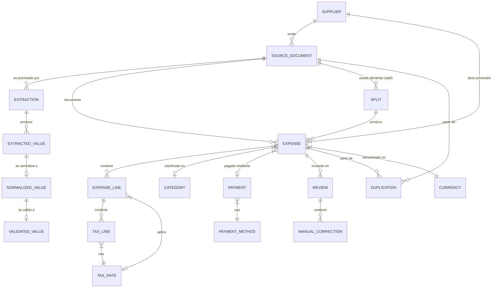

# 02 — Entidades y conceptos del dominio (GastosE)

Lista de entidades y conceptos del bounded context de GastosE, con atributos
clave, relaciones y papel. No es un modelo de datos: no prescribe tablas,
tipos de columna ni ORM (eso corresponde al modelo de persistencia
conceptual, PHASE1-003). Los atributos se dan a nivel de concepto.

## 1. Inventario

| # | Entidad / concepto | Papel en el dominio |
|---|---|---|
| E1 | Documento fuente (source document) | Evidencia primaria inmutable de un gasto. |
| E2 | Extracción (extraction) | Proceso y resultado de obtener valores extraídos de un documento fuente. |
| E3 | Valor extraído (extracted value) | Dato no fiable con confidence y provenance. |
| E4 | Valor normalizado (normalized value) | Valor en formato canónico. |
| E5 | Valor validado (validated value) | Valor que pasó validación determinística (+ revisión humana si procede). |
| E6 | Gasto (expense) | Registro contable; hecho contable solo cuando está aceptado. |
| E7 | Línea de gasto (expense line) | Concepto individual dentro de un gasto. |
| E8 | Línea fiscal (tax line) | Desglose de impuesto (IVA/retención) sobre una base. |
| E9 | Proveedor (supplier) | Emisor del documento; datos fiscales. |
| E10 | Categoría (category) | Clasificación interna del gasto. |
| E11 | Método de pago (payment method) | Medio de pago (concepto de referencia). |
| E12 | Pago (payment) | Registro del hecho de pago de un gasto. |
| E13 | Revisión (review) | Registro de una sesión de revisión humana sobre un gasto. |
| E14 | Corrección manual (manual correction) | Registro auditado de una corrección de un valor. |
| E15 | Duplicación (duplication) | Registro de una relación de duplicado entre dos documentos/gastos. |
| E16 | Evento de auditoría (audit event) | Registro inmutable de una acción relevante (quién, cuándo, qué). |
| E17 | Moneda (currency) | Referencia ISO-4217 (concepto de referencia). |
| E18 | Tipo impositivo (tax rate) | Referencia de porcentaje de impuesto (concepto de referencia). |
| E19 | Split de documento (document split) | Relación explícita documento fuente → varios gastos. |

## 2. Atributos clave por entidad

### E1 — Documento fuente

- Identificador interno (asignado por el sistema).
- Nombre de archivo seguro (generado por el sistema; nunca el original en rutas).
- Fingerprint SHA-256 del contenido.
- Tipo de documento: `received_invoice` | `ticket` | `other`.
- Formato: `xml` | `pdf_text` | `pdf_scanned` | `image` (detectado, no declarado).
- Tamaño, número de páginas.
- Usuario que subió, fecha/hora de subida.
- Estado (ver 04-lifecycle.md, ciclo A).
- Clave de duplicación (si aplica: proveedor, nº documento, fecha, importe).

### E2 — Extracción

- Documento fuente al que pertenece.
- Método usado: `xml_schema` | `pdf_text_rules` | `ocr` | `vision_llm` (cascada
  determinística; se registra el nivel alcanzado).
- Estado (ver 04-lifecycle.md, ciclo B).
- Valores extraídos resultantes (E3).
- Fecha/hora de inicio y fin.
- Motivo de fallo (si `failed`).

### E3 — Valor extraído

- Campo al que corresponde (p. e.g. `supplier.nif`, `invoice.number`,
  `line[0].amount`, `total`).
- Valor crudo (tal como se leyó).
- Confidence (0..1).
- Provenance: método, página, coordenadas/bbox, patrón o regla aplicada.
- Extracción a la que pertenece.

### E4 — Valor normalizado

- Campo.
- Valor normalizado (moneda ISO-4217 decimal exacto, fecha ISO-8601, NIF/CIF
  validado, tipo impositivo conocido).
- Valor extraído de origen (referencia a E3).
- Regla de normalización aplicada.

### E5 — Valor validado

- Campo.
- Valor validado.
- Resultado de validación: `passed` | `corrected` (por revisión humana).
- Reglas de validación aplicadas y su resultado (VR-xxx).
- Referencia a E4 y, si procede, a la corrección manual (E14).

### E6 — Gasto

- Identificador interno.
- Documento fuente al que referencia (exactamente uno; salvo split, E19).
- Proveedor (E9).
- Número de documento (nº de factura / nº de ticket).
- Fecha del documento.
- Fecha de registro.
- Moneda (E17).
- Total (base + IVA − retenciones; decimal exacto).
- Categoría (E10).
- Método de pago (E11) y pago asociado (E12).
- Estado (ver 04-lifecycle.md, ciclo C).
- Líneas de gasto (E7), líneas fiscales (E8).
- Motivo de rechazo (si `rejected`), motivo de fallo (si `failed`).
- Relación de duplicación (E15, si aplica).

### E7 — Línea de gasto

- Gasto al que pertenece.
- Descripción / concepto.
- Cantidad (decimal exacto; puede ser no monetaria, p. e.g. unidades).
- Importe (base imponible de la línea; decimal exacto).
- Tipo impositivo aplicado (E18).
- Líneas fiscales asociadas (E8).

### E8 — Línea fiscal

- Línea de gasto (o gasto, para totales) a la que pertenece.
- Tipo de impuesto: `vat` | `withholding`.
- Tipo impositivo (E18).
- Base imponible (decimal exacto).
- Cuota (decimal exacto).

### E9 — Proveedor

- Identificador interno.
- Nombre legal.
- NIF/CIF (con dígito de control validado).
- Dirección fiscal.
- Datos de contacto (opcionales).
- Estado: `active` | `inactive`.
- Gastos asociados.

### E10 — Categoría

- Identificador, nombre, descripción.
- Jerarquía (padre, si se decide jerárquica — OQ).
- Estado: `active` | `inactive`.

### E11 — Método de pago

- Identificador, nombre (efectivo, tarjeta, transferencia, cheque, otro).
- Estado: `active` | `inactive`.

### E12 — Pago

- Gasto al que pertenece.
- Método de pago (E11).
- Fecha de pago.
- Referencia (nº de operación, etc., opcional).
- Importe pagado (decimal exacto; normalmente igual al total del gasto).

### E13 — Revisión

- Gasto al que pertenece.
- Usuario, fecha/hora.
- Valores revisados (campos) y resultado por campo: `confirmed` | `corrected`
  | `rejected`.
- Comentario (opcional).

### E14 — Corrección manual

- Revisión a la que pertenece.
- Campo, valor anterior, valor posterior.
- Usuario, fecha/hora.
- Motivo (opcional).

### E15 — Duplicación

- Documento fuente A, documento fuente B (o gasto A, gasto B).
- Tipo: `fingerprint` (mismo archivo) | `logical` (misma clave de duplicación).
- Estado: `probable` | `confirmed` | `resolved_not_duplicate`.
- Usuario que resolvió, fecha/hora, motivo.

### E16 — Evento de auditoría

- Entidad afectada (y su identificador).
- Acción (p. e.g. `document.uploaded`, `value.corrected`, `expense.accepted`).
- Usuario (o sistema), fecha/hora.
- Datos antes/después (según acción).

### E17 — Moneda

- Código ISO-4217, nombre, número de decimales (p. e.g. EUR: 2).

### E18 — Tipo impositivo

- Código, descripción, tipo de impuesto (`vat` | `withholding`), porcentaje,
  período de vigencia (desde/hasta), jurisdicción.

### E19 — Split de documento

- Documento fuente.
- Gastos resultantes (más de uno).
- Usuario que lo creó, fecha/hora, justificación.

## 3. Relaciones

Reglas de cardinalidad clave (detalle en invariantes, 05-invariants.md):

- Un gasto referencia **exactamente un** documento fuente (salvo split
  explícito y documentado).
- Un documento fuente puede alimentar **varios** gastos solo mediante split
  (E19), nunca de forma implícita.
- Una línea de gasto tiene **una** base imponible y **una o varias** líneas
  fiscales (p. e.g. IVA + retención).
- Un proveedor puede emitir muchos documentos; un documento tiene **un**
  proveedor.
- Un pago pertenece a **un** gasto; un gasto puede tener **varios** pagos
  (pago parcial) — ver OQ sobre pagos parciales.

## 4. Conceptos transversales

- **Hecho contable**: solo un gasto en estado `accepted` es un hecho
  contable. Nada más (documento, extracción, valor extraído, valor validado)
  lo es.
- **Evidencia**: el documento fuente es la evidencia de un gasto aceptado; la
  trazabilidad completa (documento → extracción → valores → revisión →
  aceptación) debe poder reconstruirse (NFR-1).
- **Confianza y provenance**: atributos obligatorios de todo valor extraído;
  no son atributos de valores validados ni aceptados (éstos llevan el
  resultado de validación y la referencia a su origen).
