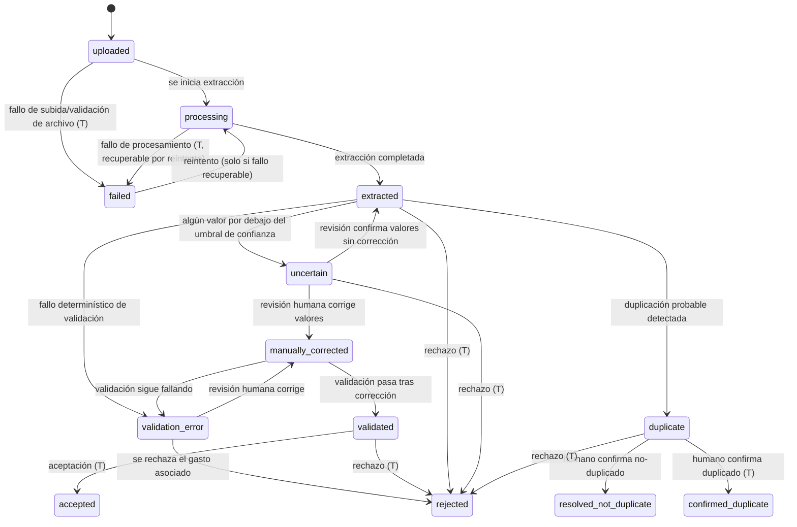
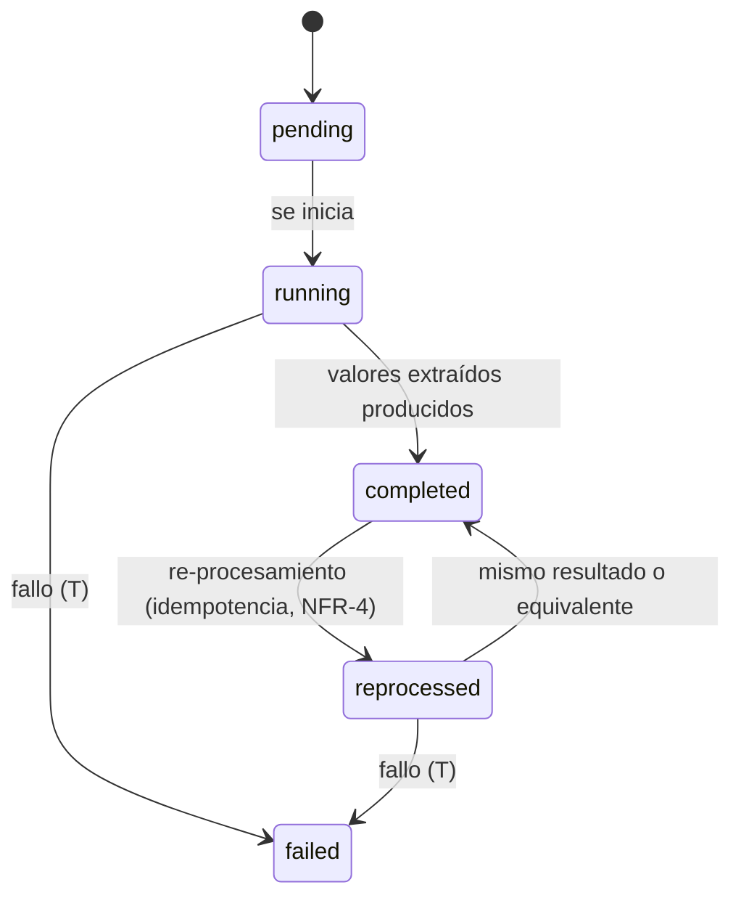
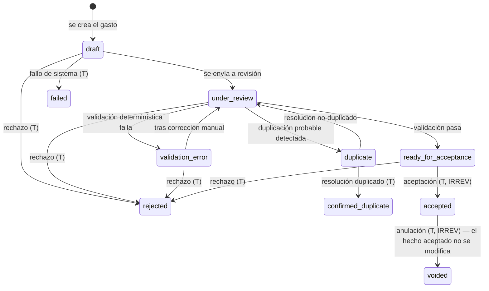
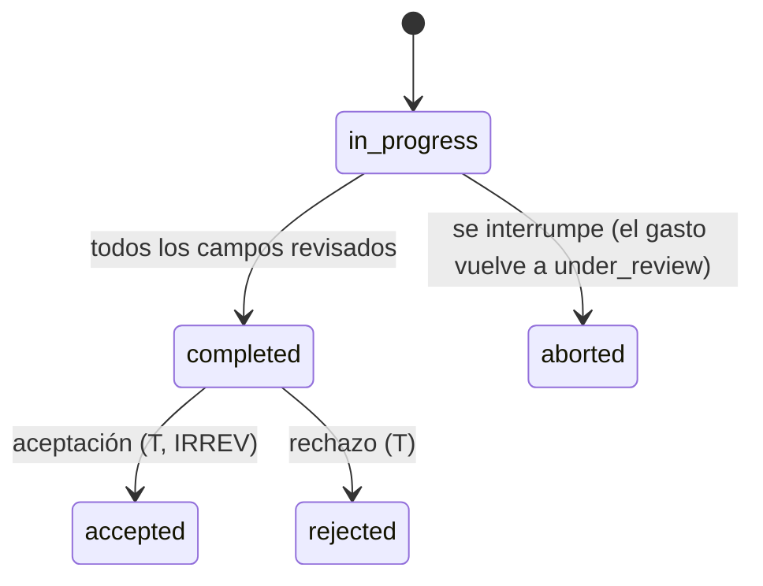

# 04 — Modelo de ciclo de vida / estados (GastosE)

Cuatro ciclos de vida relacionados: (A) documento fuente, (B) extracción,
(C) gasto, (D) revisión/aceptación. Incluye estados de fallo y de duplicado.
Se indica qué transiciones son reversibles y cuáles no.

Convención: `estado_A -> estado_B [condición]`. Las transiciones
**irreversibles** se marcan con (IRREV). Los estados terminales se marcan con
(T).

## A — Ciclo de vida del documento fuente

Notas:

- `uploaded`: documento subido y validado como archivo (tamaño, formato,
  fingerprint calculado).
- `processing`: en curso de extracción.
- `extracted`: extracción completada; valores extraídos disponibles.
- `uncertain`: algún valor con confidence por debajo del umbral; requiere
  revisión humana.
- `validation_error`: fallo determinístico (aritmética, esquema,
  normalización, referencias). No es necesariamente error humano.
- `duplicate`: duplicación `probable` detectada (fingerprint o clave
  lógica); la aceptación queda bloqueada hasta resolución.
- `manually_corrected`: un humano corrigió valores; se registra
  quién/cuándo/qué (E14).
- `validated`: todos los valores obligatorios validados.
- `accepted` (T): terminal positivo; el gasto asociado es hecho contable.
- `rejected` (T): terminal negativo con motivo.
- `confirmed_duplicate` (T): terminal; el documento se marca como duplicado
  confirmado del otro.
- `failed` (T): terminal negativo con motivo. Recuperable solo en el sentido
  de que permite un **reintento** (nueva extracción) si el fallo es
  recuperable; el estado `failed` en sí no se revierte.

**Aclaración (condición C4 de la revisión PHASE1-005)**: los estados
`validated`, `accepted` y `rejected` en el ciclo A son **estados derivados**
del estado del gasto asociado (ciclo C), no estados propios del documento
fuente. El documento fuente no se "acepta" ni se "rechaza" directamente: se
extrae, se normaliza, se valida (los valores), y se acepta (el gasto). El
estado del documento refleja el estado terminal del gasto asociado para
facilitar la consulta por documento. En la implementación, el estado del
documento en `accepted`/`rejected` se sincroniza con el estado del gasto
asociado (1:1 salvo split, INV-4).

Reversibilidad:

- Reversibles: `uncertain -> extracted` (confirmación sin corrección),
  `validation_error -> manually_corrected -> validated`,
  `duplicate -> resolved_not_duplicate`, `failed -> processing` (reintento).
- Irreversibles (IRREV): toda transición a `accepted`, `rejected`,
  `confirmed_duplicate`.

## B — Ciclo de vida de la extracción

Notas:

- `pending`: extracción creada, no iniciada.
- `running`: en curso.
- `completed`: completada; produce valores extraídos (E3).
- `failed` (T): con motivo. Permite crear una **nueva** extracción (no
  reverter esta).
- `reprocessed`: re-procesamiento del mismo documento fuente; debe ser
  idempotente (no duplicar valores).

Reversibilidad: `completed -> reprocessed -> completed` es reversible en el
sentido de que el estado final vuelve a `completed`. `failed` es terminal.

## C — Ciclo de vida del gasto

Notas:

- `draft`: borrador; se puede modificar (auditado).
- `under_review`: en revisión humana.
- `validation_error`: fallo determinístico; requiere corrección manual o
  rechazo.
- `duplicate`: duplicación `probable` pendiente de resolución.
- `ready_for_acceptance`: todos los valores obligatorios validados; pendiente
  de aprobación.
- `accepted` (T, IRREV): hecho contable. No se modifica; solo puede
  anularse (FR-EXP-5).
- `voided` (T, IRREV): anulado; el gasto aceptado original conserva su estado
  `accepted` y se crea un registro de anulación que lo neutraliza.
- `rejected` (T): con motivo; no se acepta directamente (FR-REJ-2).
- `confirmed_duplicate` (T): el gasto se marca como duplicado confirmado.
- `failed` (T): fallo de sistema con motivo.

Reversibilidad:

- Reversibles: `validation_error -> under_review` (tras corrección),
  `duplicate -> under_review` (resolución no-duplicado).
- Irreversibles (IRREV): toda transición a `accepted`, `rejected`,
  `confirmed_duplicate`, `voided`.

## D — Ciclo de vida de la revisión / aceptación

La revisión (E13) es una actividad sobre el gasto en `under_review`. No es un
objeto con ciclo de vida propio, pero sus resultados sí:

Por campo, el resultado de revisión es:

- `confirmed`: el valor normalizado se confirma como validado.
- `corrected`: el valor se corrige (E14) y pasa a validado.
- `rejected`: el campo (y por tanto el gasto) se rechaza.

Reversibilidad: `aborted` es reversible (vuelve a `under_review`).
`accepted` y `rejected` son irreversibles.

## Reglas transversales de transición

1. **Ninguna transición a `accepted`** sin pasar por `validated` /
   `ready_for_acceptance` (INV-8).
2. **Ningún valor extraído se acepta** sin normalización y validación
   (08-value-semantics.md).
3. **Duplicación `probable`** bloquea la aceptación hasta resolución
   (DUP-3).
4. **Todo estado terminal** (`accepted`, `rejected`, `failed`,
   `confirmed_duplicate`, `voided`) es irreversible; las únicas salidas
   "lógicas" son crear un nuevo objeto (nueva extracción, nuevo gasto) o
   anular (FR-EXP-5).
5. **Toda transición** queda registrada en auditoría (E16): de-estado,
   a-estado, usuario/sistema, fecha/hora, motivo si procede.
6. **Los estados de fallo** (`failed`, `validation_error`) siempre llevan
   motivo registrado (FR-FST-1).
