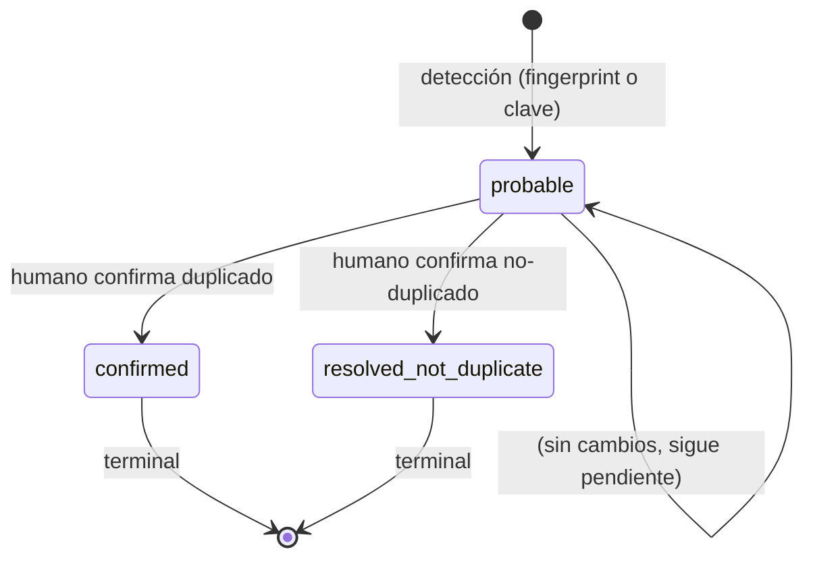

# 07 — Manejo de duplicados (GastosE)

Definición de duplicado (probable vs confirmado), estrategia de detección,
estados/resultados posibles y reglas de resolución. Identificadores:
`DUP-n`.

## 1. Definición

- **Duplicado probable** (probable duplicate): pareja de documentos fuente o
  de gastos que coincide por **fingerprint SHA-256** (mismo archivo) o por
  **clave de duplicación** (proveedor, número de documento, fecha, importe
  total) y está **pendiente de resolución humana**. No se asume que sea el
  mismo hecho: la coincidencia es una señal, no una prueba.
- **Duplicado confirmado** (confirmed duplicate): pareja **resuelta por un
  humano** como el mismo hecho de compra. El segundo documento/gasto queda
  marcado como duplicado confirmado y **no se acepta**.
- **No-duplicado confirmado** (resolved not duplicate): pareja resuelta por
  un humano como **hechos distintos** (p. e.g. dos compras idénticas el
  mismo día). Ambos pueden aceptarse.

La distinción probable/confirmado es obligatoria: nunca se trata un
duplicado probable como confirmado (INV-6).

## 2. Estrategia de detección

Dos mecanismos complementarios:

### DUP-1 — Detección por fingerprint (mismo archivo)

- Al subir un documento fuente, se calcula su fingerprint SHA-256.
- Si el fingerprint coincide con el de un documento fuente ya existente, se
  crea una duplicación de tipo `fingerprint` en estado `probable`.
- Es la detección más fiable: mismo contenido byte a byte.
- Caso típico: re-subida del mismo archivo.

### DUP-2 — Detección por clave de duplicación (duplicado semántico)

- Tras la extracción, se construye la **clave de duplicación**:
  `(proveedor, número de documento, fecha, importe total)`.
- Si la clave coincide con la de un gasto o documento existente, se crea una
  duplicación de tipo `logical` en estado `probable`.
- Menos fiable que el fingerprint: dos compras idénticas (mismo proveedor,
  misma factura por error, o dos tickets iguales) pueden coincidir sin ser el
  mismo hecho. Por eso requiere resolución humana.
- Para tickets sin número de documento, la clave es
  `(proveedor, fecha, importe total)` y la detección se marca como **menos
  fiable** (FR-TCK-3); el umbral de sospecha puede ser más alto.

### DUP-3 — Momento de la detección

- Fingerprint: en la subida (antes de la extracción).
- Clave de duplicación: al completar la extracción (cuando hay proveedor,
  número, fecha e importe).
- La detección no bloquea la extracción: el documento sigue procesándose,
  pero el gasto queda con duplicación `probable` y la aceptación bloqueada
  (INV-6).

## 3. Estados y resultados posibles

- `probable`: pendiente de resolución; bloquea la aceptación (INV-6).
- `confirmed` (terminal): el segundo documento/gasto se marca como
  duplicado confirmado; no se acepta.
- `resolved_not_duplicate` (terminal): ambos pueden continuar su ciclo de
  vida normal.

## 4. Reglas de resolución

| ID | Regla | Descripción |
|---|---|---|
| DUP-4 | Resolución humana obligatoria | Solo un humano resuelve una duplicación `probable` (confirmar duplicado o confirmar no-duplicado). No hay resolución automática. |
| DUP-5 | Resolución auditada | La resolución registra: usuario, fecha/hora, decisión, motivo. |
| DUP-6 | Bloqueo hasta resolución | Mientras haya duplicación `probable` sobre un gasto, la aceptación está bloqueada (INV-6). |
| DUP-7 | Reversibilidad limitada | Una resolución es reversible **solo** si no hay gasto aceptado afectado por ella. Si ya hay un gasto aceptado, la resolución no se revierte; se corrige creando un nuevo registro y anulando el aceptado si procede (FR-EXP-5). |
| DUP-8 | Duplicado confirmado no se acepta | Un gasto marcado como duplicado confirmado no puede aceptarse; si se intenta, el sistema lo bloquea y ofrece rechazarlo o crear un gasto nuevo. |
| DUP-9 | Fingerprint tiene prioridad | Si hay coincidencia de fingerprint, la duplicación es de tipo `fingerprint` (más fiable) aunque también coincida la clave. |
| DUP-10 | Múltiples duplicaciones | Un documento puede tener varias duplicaciones `probable` (con distintos otros documentos); cada una se resuelve por separado. |

## 5. Interacción con el ciclo de vida

- La duplicación `probable` pone el documento fuente en estado `duplicate`
  (ciclo A) y el gasto en estado `duplicate` (ciclo C).
- La resolución `resolved_not_duplicate` devuelve el documento/gasto a
  `extracted`/`under_review` (según el estado previo).
- La resolución `confirmed` lleva el documento/gasto a `confirmed_duplicate`
  (terminal).
- La resolución no afecta al documento fuente "original" (el primero): solo
  al segundo (el detectado como duplicado). Si el humano decide que el
  primero es el duplicado, se marca el primero y el segundo continúa.

## 6. Preguntas relacionadas (ver 10-open-questions.md)

- OQ-7: ¿se permite resolución por regla aprobada (p. e.g. fingerprint
  idéntico + mismo usuario + mismo día => auto-confirmar)? Por defecto: no
  (DUP-4).
- OQ-8: ¿qué umbral de similitud para la clave de duplicación (p. e.g. fecha
  ±1 día, importe ±0,01)? Por defecto: coincidencia exacta.
